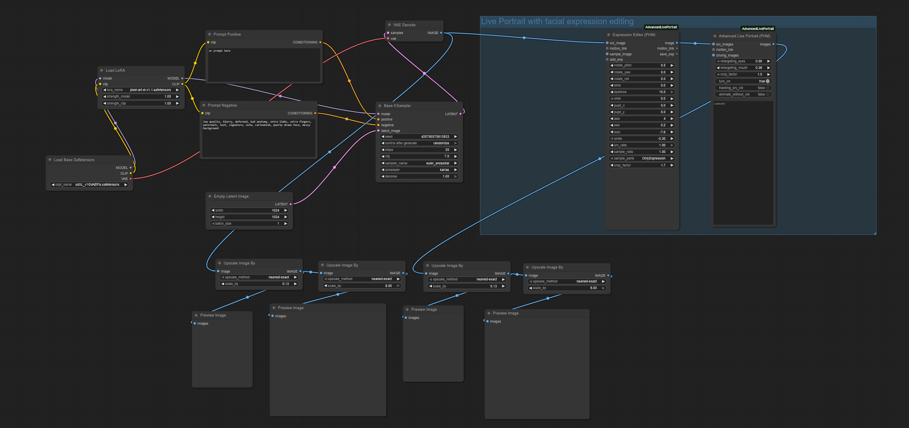

# Pixel Art Character Workflow for ComfyUI

It is a great setup for anyone looking to create high-quality pixel art characters for games. It uses ComfyUI, which is a node-based tool that gives you full control over how the AI generates your art, step by step.

## The Workflow

## How it works

The base of the project is the [Stable Diffusion XL (SDXL)](https://civitai.com/models/101055/sd-xl) model. It’s a powerful engine that provides the structure and detail needed for modern character design. 

To get that specific pixel art look, the workflow uses the [Pixel Art XL LoRA](https://civitai.com/models/120096/pixel-art-xl), which trains the AI to understand pixel grids, clean lines, and the classic color palettes used in video games.

One of the coolest parts is the integration of [Advanced LivePortrait](https://github.com/PowerHouseMan/ComfyUI-AdvancedLivePortrait). Instead of just generating a static image, you can use the Expression Editor to change how the character looks. You can make them smile, wink, or look angry without changing the rest of the design. This is super helpful for game devs who need different "moods" for dialogue boxes or UI icons.

Finally, the workflow handles the technical side of pixel art. Since AI usually makes big, smooth images, this setup automatically shrinks the image down using a "Nearest-Exact" method. This keeps the edges sharp and ensures every pixel is exactly where it should be. The result is a crisp, professional asset that’s ready to be dropped straight into Unity, Godot, or any other game engine.

## Requirements
* ComfyUI installed
* SDXL Base Model
* Pixel Art XL LoRA
* ComfyUI-AdvancedLivePortrait nodes
